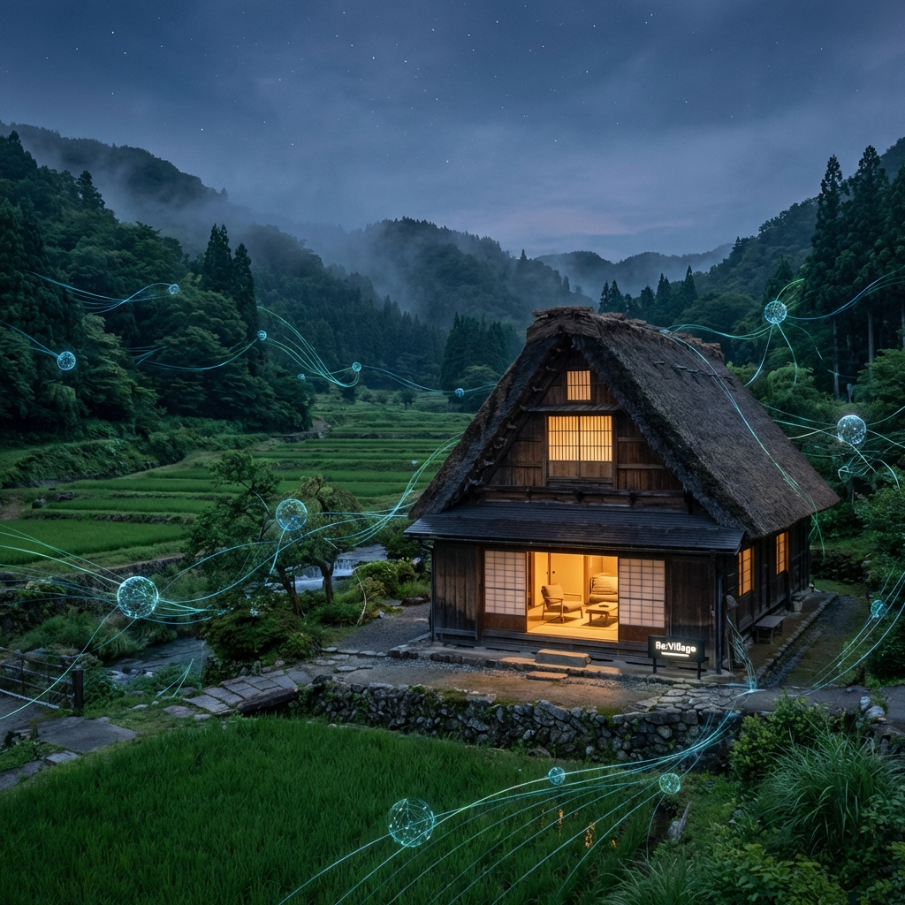

# Re:Village (リ・ビレッジ)

> *Generated by AI: Conceptual visualization of Re:Village*

## 📖 Overview
**Re:Village** は、「不便さを楽しみ、生きる力を取り戻す」をコンセプトにした、Web3時代の新しい里山体験プラットフォームです。

デジタルデバイスが飽和した現代において、あえてスマホを手放し（Digital Detox）、薪割りや自炊といった「アナログな原体験」をエンターテインメントとして提供します。その裏側では、NFTによる会員権管理やDAOによるコミュニティ運営など、最先端の技術（Invisible Tech）が持続可能な地域運営を支えています。

## 🎯 Mission & Vision
* **Mission:** デジタル過多による家族の断絶を解消し、人間本来の「生きる力」を取り戻す。
* **Vision:** 限界集落の古民家を再生し、世界中の人々が「第二の故郷」として回遊する分散型村社会（Decentralized Village）を構築する。

## 💡 Key Features (Village OS)
本プロジェクトでは、物理的な宿泊施設の運営に加え、以下のシステム群（Village OS）を開発・運用します。

### 0. 候補地

#### 広島県

* [No.372](https://mihara-c34204.akiya-athome.jp/bukken/detail/buy/40884) : 広島県三原市大和町和木
* [No.390](https://mihara-c34204.akiya-athome.jp/bukken/detail/buy/43929) : 広島県三原市久井町坂井原
* [No.215](https://takehara-c34203.akiya-athome.jp/bukken/detail/buy/43751) : 広島県竹原市塩町３丁目
* [No.342](https://mihara-c34204.akiya-athome.jp/bukken/detail/buy/42376) : 広島県三原市大和町椋梨
* [No.335](https://mihara-c34204.akiya-athome.jp/bukken/detail/buy/42372) : 広島県三原市須波１丁目
* [No.325](https://mihara-c34204.akiya-athome.jp/bukken/detail/buy/42364) : 広島県三原市大和町萩原

#### 岡山県

* [中古住宅](https://soja-c33208.akiya-athome.jp/bukken/detail/buy/44408) : 岡山県総社市新本
* [山市林田　平屋一軒家](https://tsuyama-c33203.akiya-athome.jp/bukken/detail/buy/44253) : 岡山県津山市林田
* [No.248 新見市哲多町成松](https://niimi-c33210.akiya-athome.jp/bukken/detail/buy/44195) : 岡山県新見市哲多町成松
* [MY034 　美咲町王子](https://misaki-t33666.akiya-athome.jp/bukken/detail/buy/44180) : 岡山県久米郡美咲町王子
* [笠岡市空き家バンクNo.697](https://kasaoka-c33205.akiya-athome.jp/bukken/detail/buy/44047) : 岡山県笠岡市大宜
* [中古住宅](https://wake-t33346.akiya-athome.jp/bukken/detail/buy/43762) : 岡山県和気郡和気町父井原
* [中古住宅](https://wake-t33346.akiya-athome.jp/bukken/detail/buy/43715) : 岡山県和気郡和気町岩戸
* [【336】上田西](https://kibichuo-t33681.akiya-athome.jp/bukken/detail/buy/43491) : 岡山県加賀郡吉備中央町上田西
* [離れ、倉庫2棟付き中古戸建て](https://wake-t33346.akiya-athome.jp/bukken/detail/buy/43000) : 岡山県和気郡和気町保曽
* [里庄町大字里見中古戸建](https://satosho-t33445.akiya-athome.jp/bukken/detail/buy/42878) : 

### 1. Membership NFT System
* **概要:** 宿泊優先権、DAO参加権、デジタルキー機能を内包したNFT会員証。
* **目的:** コミュニティの質を担保し、持続可能な収益モデル（スモールマス戦略）を確立する。
* **Tech:** Ethereum/Polygon, Smart Contract (ERC-721 based).

### 2. Quest & Gamification
* **概要:** 「薪割り」「野菜収穫」などの労働を「クエスト」として定義。
* **目的:** 労働をエンタメ化し、ゲストが能動的に地域活動に参加する仕組み。
* **Tech:** Web App (PWA), QR Code verification.

### 3. Thanks Tip Economy
* **概要:** ゲストから地域住民（キャスト）へ、スマホを使わずに感謝（Tip）を送るシステム。
* **目的:** 地域への直接的な経済還元と、住民のモチベーション向上。
* **Tech:** NFC Tags / Wood Token linked to Blockchain ledger.

## 🛠 Tech Stack (Planned)
* **Frontend:** Next.js, TypeScript, Tailwind CSS
* **Backend:** Node.js, Supabase (PostgreSQL)
* **Blockchain:** Solidity, Thirdweb SDK
* **Infrastructure:** Vercel, AWS
* **Communication:** Discord API (Community Management)

## 🗺 Roadmap
- [ ] **Phase 1: Zero to One (Current)**
    - [ ] 岡山県美作エリアでの物件取得・リノベーション
    - [ ] 旅館業法（簡易宿所）許可取得
    - [ ] Membership NFT プレセール
    - [ ] 1号店オープン（PoC）
- [ ] **Phase 2: Systematization**
    - [ ] 運営オペレーションの自動化・アプリ化
    - [ ] Village OSのパッケージ化
- [ ] **Phase 3: Scale & Global**
    - [ ] 国内他拠点へのフランチャイズ展開
    - [ ] インバウンド向け「Satoyama」ブランド確立

## 🤝 Contribution
本プロジェクトは現在、Core Memberによるクローズドな開発フェーズですが、DIY（物理）およびSystem（開発）への協力者を歓迎します。
興味のある方は、[Discord Community Link] または Issues でコンタクトを取ってください。

## 📄 License
[MIT License](LICENSE) (System parts) / Proprietary (Business logic & Assets)

---
*Created by Tomoya & Gemini (Co-Founder AI)*
# ReVillage
